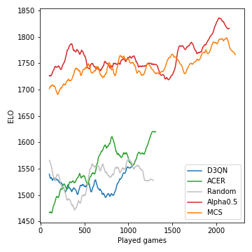

# Beating *6 nimmt!* with reinforcement learning


### 6 nimmt!

[6 nimmt!](https://boardgamegeek.com/boardgame/432/6-nimmt) is an award-winning card game for two to ten players from 1994. Quoting [Wikipedia](https://en.wikipedia.org/wiki/6_Nimmt!):
> The game has 104 cards, each bearing a number and one to seven bull's heads symbols that represent penalty points. A round of ten turns is played where all players place one card of their choice onto the table. The placed cards are arranged on four rows according to fixed rules. If placed onto a row that already has five cards then the player receives those five cards, which count as penalty points that are totaled up at the end of the round.

6 nimmt! is a competitive game of incomplete information and a large amount of stochasticity. Playing well requires a fair bit of planning. The simultaneous game play lends itself to mind games and bluffing, while some long-term strategy is necessary to avoid ending up in difficult end-game positions.

We implemented a slightly simplified version of 6 nimmt! as an [OpenAI gym](https://gym.openai.com/) environment. Unlike in the original game, when playing a lower card than the last card on all stacks, the player cannot freely choose which stack to replace, but instead will always take the stack with the smallest number of penalty points.


### RL agents

So far we have implemented the following agents:
- **REINFORCE**: The original policy gradient algorithm.
- **ACER**: An off-policy actor-critic agent with truncated importance sampling with bias correction. Unlike [the original ACER](https://arxiv.org/abs/1611.01224), our implementation does not use trust region policy optimization or dueling stochastic networks.
- **D3QN**: A deep dueling double Q-learning algorithm with priority replay buffer and noisy nets. This has most elements of [Rainbow](https://arxiv.org/abs/1710.02298).
- **MCS**: A Monte-Carlo search in which all actions are sampled uniformly (no neural network involved).
- **Alpha0.5**: Monte-Carlo tree search guided by a neural policy and PUCT. Inspired by [AlphaZero](https://arxiv.org/abs/1712.01815) and similar algorithms, modified for the incomplete information scenario of 6 nimmt!.
- **Random**: A random policy baseline.
- **Human**: Interface for human players. 


### Results

As a first test, we ran a simple self-play tournament. Starting with five untrained agents, we played 4000 games in total. For each game we randomly selected two, three, or four agents to play (and learn). Every 400 games we cloned the best-performing agent and kicked out some of the poorer-performing ones. In the end we just kept the best instance of each agent type.

Results over all games:

| Agent | Games played | Mean score | Win fraction | ELO |
|---|---|---|---|---|
| **Alpha0.5** |  2246 |      -7.79 |         0.42 | 1806 
| **MCS** |  2314 |      -8.06 |         0.40 | 1745 
| **ACER** |  1408 |     -12.28 |         0.18 | 1629 | 
| **D3QN** |   1151 |     -13.32 |         0.17 | 1577 |
| **Random** |  1382 |     -13.49 |         0.19 | 1556 

This is how the performance (measured in ELO) of the models developed during the course of the tournament:



Monte-Carlo tree search is crucial and leads to strong players. The model-free RL agents, on the other hand,  struggle to even clearly outperform the random baseline. Due to the stochastic nature of the game, the win probabilities and ELO differences are not nearly as drastic as they could be, say, for chess. Note that we haven't tuned any of the many hyperparameters.

After this self-play phase, the Alpha0.5 agent faced Merle, one of the best 6 nimmt! players in our group of friends, for 5 games. These are the scores:

| Game | 1 | 2 | 3 | 4 | 5 | Sum |
|---|---|---|---|---|---|---|
| **Merle** | -10 | -16 | **-11** | **-3** | **-4** | -44 |
| **Alpha0.5** | **-1** | **-3** | -14 | -8 | -6 | **-32** |


### Running the code

Assuming you have anaconda installed, clone the repo with

```
git clone git@github.com:johannbrehmer/rl-6-nimmt.git
```

and create a virtual environment with

```
conda env create -f environment.yml
conda activate rl
```

Both agent self-play and games between a human player and trained agents are demonstrated in [simple_tournament.ipynb](experiments/simple_tournament.ipynb).


## Contributors

Put together by Johann Brehmer and Marcel Gutsche.
